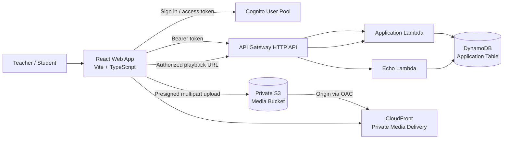
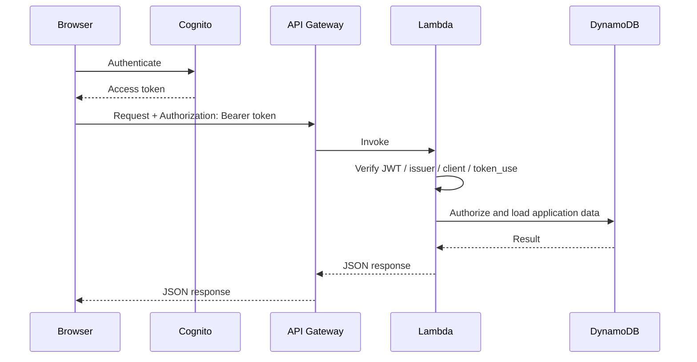
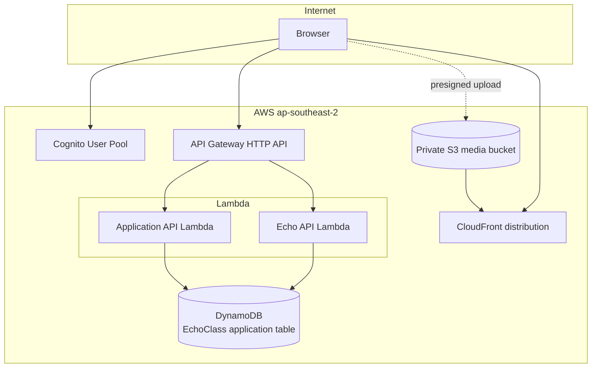
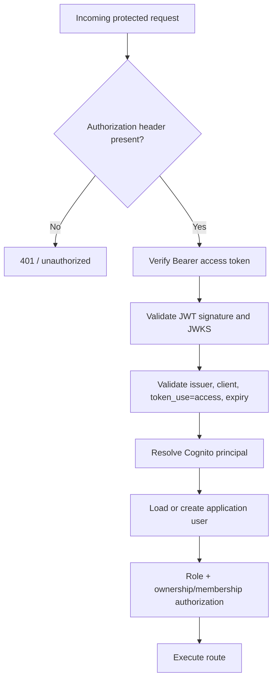
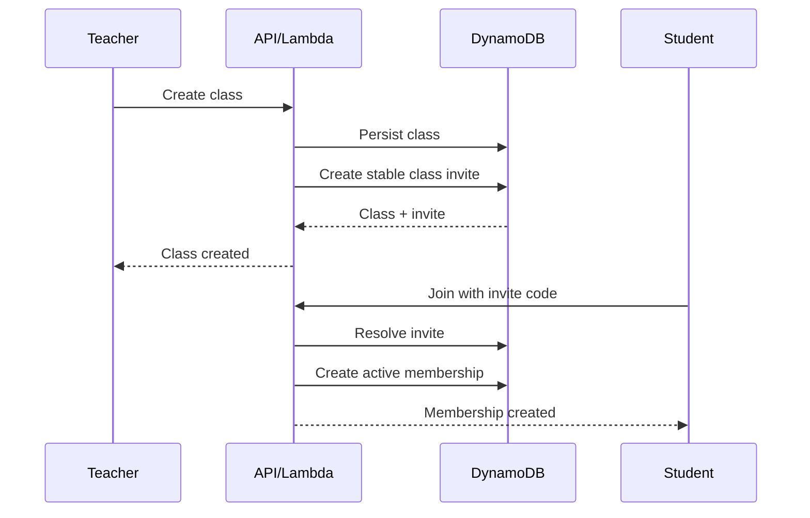
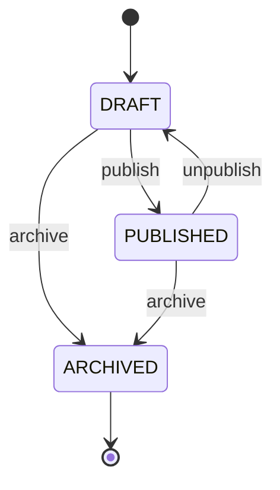
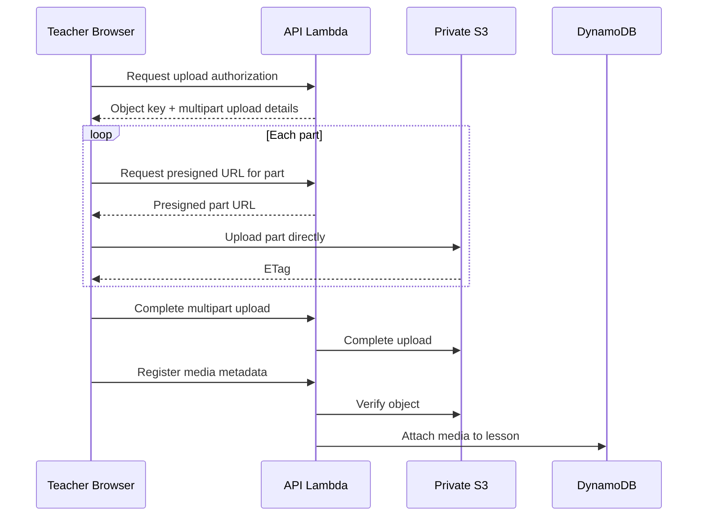
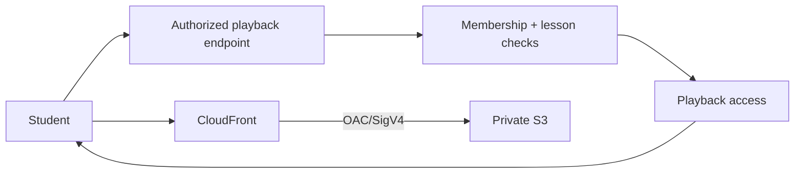
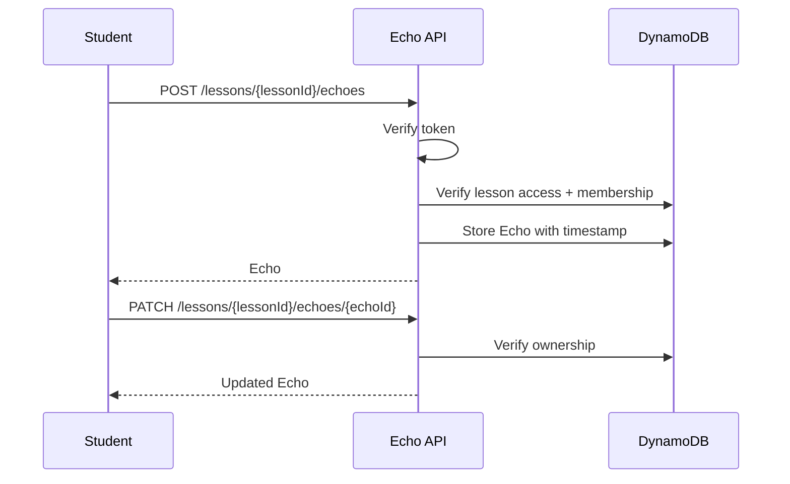

# EchoClass

> A collaborative learning platform where teachers organize classes and lessons, students securely access lesson video, and learners create timestamped **Echoes** while studying.

**Current documentation snapshot:** August 2026 — reflects the implementation currently present on `feat/echo-mvp`.

## What is implemented today

- React + TypeScript + Vite web application.
- Cognito-backed authentication boundary.
- Teacher and student application roles.
- Class creation, listing, detail, membership, and invite-code flows.
- Lesson creation, editing, lifecycle management, and media metadata.
- Direct browser-to-private-S3 multipart video uploads using short-lived presigned URLs.
- Private S3 media storage.
- CloudFront in front of S3 for media delivery.
- Cognito access-token verification inside Lambda.
- Student-authorized lesson playback endpoint.
- Timestamped Echo CRUD endpoints.
- AWS CDK infrastructure for DynamoDB, S3, CloudFront, API Gateway, and Lambda.
- Local frontend development against the deployed API at `http://localhost:5173`.

> The documentation intentionally distinguishes **implemented** behavior from planned/future behavior. Do not treat older planning documents as the current source of truth.

---

# Architecture at a glance



## Core request boundaries



---

# Repository structure

```text
echoclass/
├── apps/
│   ├── web/                 # React frontend
│   └── api/                 # API TypeScript workspace foundation
├── infrastructure/
│   ├── bin/                 # CDK app entry point
│   ├── lib/
│   │   └── echoclass-stack.ts
│   └── lambda/              # Runtime Lambda handlers/repositories
├── types/
│   ├── api.ts               # Shared API contracts
│   └── domain.ts            # Shared domain contracts
├── docs/                    # Product/design/history documentation
├── package.json             # pnpm workspace root
└── pnpm-workspace.yaml
```

## Important runtime modules

- `api-handler.mjs` — authenticated application API: users, classes, memberships, lessons, uploads, playback.
- `echo-handler.mjs` — Echo CRUD API.
- `auth.mjs` — Cognito JWT verification.
- `user-repository.mjs` — application user persistence.
- `class-repository.mjs` — class persistence and queries.
- `membership-repository.mjs` — memberships and invite codes.
- `lesson-repository.mjs` — lesson persistence and lifecycle.
- `media-upload.mjs` — multipart S3 upload orchestration.
- `lesson-playback.mjs` — playback authorization construction.
- `echo-repository.mjs` — Echo persistence.

---

# Product model

```mermaid
erDiagram
  USER ||--o{ CLASS : owns
  USER ||--o{ MEMBERSHIP : has
  CLASS ||--o{ MEMBERSHIP : contains
  CLASS ||--o{ LESSON : contains
  LESSON ||--o{ ECHO : contains
  USER ||--o{ ECHO : creates

  USER {
    string id
    string role
    string username
    string email
  }
  CLASS {
    string id
    string teacherId
    string name
  }
  MEMBERSHIP {
    string classId
    string studentId
    string status
  }
  LESSON {
    string id
    string classId
    string status
    object media
  }
  ECHO {
    string id
    string lessonId
    string studentId
    number timestampSeconds
  }
```

## Roles

### Teacher
- Creates and manages classes.
- Owns class-scoped invite codes.
- Views/manages class members.
- Creates and edits lessons.
- Uploads lesson video.
- Publishes, unpublishes, or archives lessons.

### Student
- Joins a class using an invite code.
- Sees classes where active membership exists.
- Sees only published lessons.
- Requests authorized playback for accessible lesson media.
- Creates, edits, and deletes their own Echoes.

---

# Current AWS architecture



## Infrastructure resources

The CDK stack currently creates:

### DynamoDB
- One application table with `PK` and `SK`.
- On-demand billing.
- AWS-managed encryption.
- Point-in-time recovery.
- `GSI1` and `GSI2` for alternate access patterns.

### S3
- Private media bucket.
- Block Public Access enabled.
- SSL enforced.
- Bucket-owner-enforced ownership.
- CORS for local development uploads.
- Lifecycle rule for abandoned multipart uploads.

### CloudFront
- S3 origin.
- Origin Access Control (OAC) with SigV4.
- Viewer GET/HEAD only.
- HTTP redirected to HTTPS.
- S3 bucket grants reads only to the CloudFront service principal scoped to the distribution.

### API Gateway
- HTTP API.
- `/health` route.
- Dedicated Echo routes.
- Catch-all application Lambda integration.
- CORS for `http://localhost:5173`.

### Lambda
- Node.js 22.x runtime.
- Separate application API and Echo API handlers.
- DynamoDB access.
- Application Lambda also has media-bucket access for upload orchestration.

---

# Authentication and authorization



Protected routes use Cognito access tokens. Verification checks the token structure/signature, Cognito JWKS, issuer, token use, configured app client, and expiration. `GET /health` remains public.

Application authorization does **not** trust client-supplied owner IDs or roles. Ownership and membership are resolved server-side.

---

# Class and invite-code lifecycle



**Important invariant:** a class invite code is created for the class and should be read thereafter; merely opening or refreshing a class must not generate additional invite codes.

---

# Lesson lifecycle



Teachers manage lessons only for classes they own. Students can access only lessons that are published and belong to a class where they have active access.

---

# Video upload flow

EchoClass uploads video directly from the browser to S3. Lambda coordinates authorization and metadata; it does not proxy video bytes.



Upload validation currently enforces video content types and a maximum request size of 5 GB.

---

# Media delivery and playback

The intended boundary is:



The browser should receive playback access and fetch media from the delivery layer rather than downloading video bytes through Lambda. S3 remains private.

---

# Echoes

An Echo is a student-owned, timestamped learning observation associated with a lesson.



Current dedicated Echo routes include:

- `GET /echoes`
- `POST /echoes`
- `GET /lessons/{lessonId}/echoes`
- `POST /lessons/{lessonId}/echoes`
- `PATCH /lessons/{lessonId}/echoes/{echoId}`
- `DELETE /lessons/{lessonId}/echoes/{echoId}`

---

# Application API surface

All application routes are exposed under the API's HTTP path and the handler normalizes `/api` and `/api/v1` prefixes.

## Health

- `GET /health`

## Current user

- `GET /me`

## Classes

- `GET /classes`
- `POST /classes`
- `GET /classes/{classId}`
- `PATCH /classes/{classId}`

## Invites and membership

- `POST /invites/join`
- `POST /classes/{classId}/invite`
- `GET /classes/{classId}/members`
- `DELETE /classes/{classId}/members/{studentId}`

## Lessons

- `GET /classes/{classId}/lessons`
- `POST /classes/{classId}/lessons`
- `GET /lessons/{lessonId}`
- `PATCH /lessons/{lessonId}`
- `POST /lessons/{lessonId}/publish`
- `POST /lessons/{lessonId}/unpublish`
- `POST /lessons/{lessonId}/archive`

## Media

- `POST /lessons/{lessonId}/upload`
- `POST /lessons/{lessonId}/upload/part`
- `POST /lessons/{lessonId}/upload/complete`
- `POST /lessons/{lessonId}/upload/abort`
- `POST /lessons/{lessonId}/media`
- `GET /lessons/{lessonId}/playback`
- `GET /lessons/{lessonId}/timeline`

## Echoes

See the dedicated Echo section above.

API failures use a stable JSON error shape:

```json
{
  "error": {
    "code": "SOME_CODE",
    "message": "Human-readable message"
  }
}
```

---

# Frontend

The web application is a React 19 + TypeScript + Vite application.

Key frontend tooling includes:

- React Router.
- TanStack React Query.
- React Hook Form + Zod.
- Tailwind CSS.
- shadcn/Base UI.
- next-themes for persisted light/dark/system theme behavior.
- Lucide icons.

The existing frontend product work includes authentication foundations, shared shell/navigation, account controls, settings, theme selection, teacher class/lesson experiences, and the current Echo MVP work on this branch.

## Local development

Create `apps/web/.env` from `apps/web/.env.example` and provide the frontend configuration required by the deployed API/auth setup.

From the repository root:

```bash
pnpm install
pnpm --filter web dev
```

The Vite development server is expected at:

```text
http://localhost:5173
```

Build the web app:

```bash
pnpm --filter web build
```

Useful repository commands:

```bash
pnpm dev
pnpm build
pnpm lint
pnpm typecheck
pnpm test
pnpm format:check
```

---

# CDK infrastructure development

The infrastructure is located in `infrastructure/` and uses AWS CDK.

Typical workflow:

```bash
cd infrastructure
pnpm install
pnpm cdk synth
pnpm cdk deploy
```

Use the environment configuration already defined by the CDK application. Do not commit generated credentials or secrets.

---

# Shared contracts

The repository has a shared `types/` directory:

- `types/domain.ts` — User, Class, Membership, Lesson, Echo, Revisit and media authorization concepts.
- `types/api.ts` — API-level response/request shapes.

The backend and frontend should evolve these contracts together instead of independently redefining the same entities.

---

# Documentation map

## Current-source documentation

This README is the top-level entry point for the current implementation.

The following documents are still useful and are organized by their original planning purpose:

- `docs/01-requirements.md` — original product requirements.
- `docs/02-page-architecture.md` — page architecture.
- `docs/03-wireframes.md` — wireframes.
- `docs/04-visual-prototype.md` — visual prototype notes.
- `docs/05-component-architecture.md` — component architecture.
- `docs/06-code.md` — earlier code/design notes.
- `docs/07-implementation-plan.md` — phased execution plan.
- `docs/08-implementation-state.md` — historical implementation ledger; some statuses predate the current Echo MVP branch.
- `docs/09-landing-page-plan.md` — landing-page plan.
- `docs/10-account-settings-plan.md` — account/settings slice.
- `docs/11-mvp-execution-plan.md` — MVP execution plan.
- `docs/12-mvp-domain-contracts.md` — original shared domain/API contract summary.
- `docs/13-aws-infrastructure-foundation.md` — AWS foundation notes.
- `docs/14-dynamodb-access-patterns.md` — DynamoDB access patterns.
- `docs/15-private-media-storage.md` — private S3 storage.
- `docs/16-private-media-delivery.md` — CloudFront/OAC delivery foundation.
- `docs/17-api-lambda-foundation.md` — API Gateway/Lambda foundation.
- `docs/18-cognito-token-verification.md` — Cognito verification foundation.

## Documentation rule

When implementation changes:

1. Update this README if the system architecture or developer workflow changes.
2. Update the most relevant detailed document for deeper behavior.
3. Prefer Mermaid diagrams for architecture, lifecycle, sequence, and state documentation.
4. Explicitly mark future work rather than describing it as already implemented.

---

# Security model

- Cognito access tokens authenticate protected API requests.
- Lambda verifies tokens; the browser does not receive DynamoDB credentials.
- Authorization is derived server-side from ownership and membership.
- S3 media is not public.
- CloudFront uses OAC to access S3.
- Video bytes are not proxied through Lambda.
- Browser uploads use short-lived presigned URLs rather than AWS IAM credentials.
- Secrets and AWS credentials must never be committed.

---

# Current implementation status

The `feat/echo-mvp` branch is the authoritative snapshot for this documentation update.

Implemented backend foundations include:

- Cognito token verification.
- User bootstrap.
- Class and membership workflows.
- Stable invite-code handling.
- Lesson management and lifecycle.
- Direct multipart media upload orchestration.
- Private media storage and CloudFront infrastructure.
- Authorized student playback/timeline endpoints.
- Dedicated Echo Lambda routes and persistence.

The next documentation updates should be made alongside future implementation slices so this README remains a living architectural reference rather than another planning-only document.
