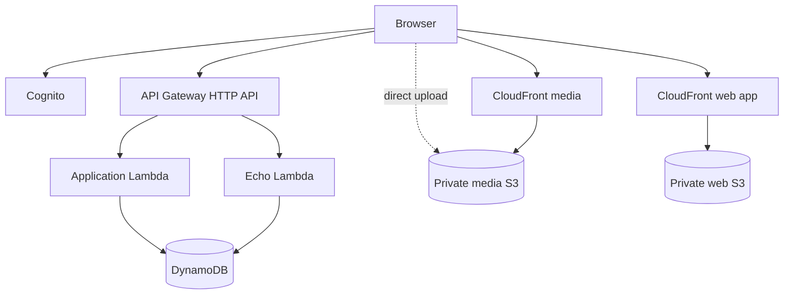

# EchoClass — AWS Infrastructure Foundation

This document records the current AWS infrastructure boundary for EchoClass MVP and the subsequent public web deployment.

## Environment

- Environment name: `dev` by default; `prod` uses production retention policies.
- Default development region: `ap-southeast-2` (Sydney).
- Infrastructure as code: AWS CDK with TypeScript.
- Stack name: `EchoClass-<environment>`.

The region is configurable through the standard CDK/AWS environment variables and is not hard-coded into deployed resource definitions, although the current Cognito User Pool is in `ap-southeast-2`.

## Current resource set

The CDK stack currently provisions:

### Application data

- DynamoDB application table with `PK`/`SK`.
- `GSI1` and `GSI2` for documented alternate access patterns.
- On-demand billing.
- AWS-managed encryption.
- Point-in-time recovery.

### Private media

- Private S3 media bucket.
- Block Public Access enabled.
- Bucket-owner-enforced ownership.
- SSL enforced.
- Browser multipart upload CORS for localhost.
- Lifecycle cleanup for abandoned multipart uploads.
- Dedicated CloudFront media distribution using Origin Access Control (OAC).
- S3 policy grants `s3:GetObject` only to the CloudFront service principal scoped to that distribution.

### Public web application delivery

- Separate private S3 bucket for the Vite production bundle.
- Block Public Access enabled.
- Bucket-owner-enforced ownership.
- Dedicated CloudFront distribution using OAC.
- Viewer HTTP redirected to HTTPS.
- `index.html` is the default root object.
- CloudFront 403/404 responses are mapped to `/index.html` with status 200 for React Router deep links.
- CDK `BucketDeployment` uploads `apps/web/dist` and invalidates the distribution after deployment.

The web S3 bucket is **not** an S3 website endpoint. CloudFront is the public delivery boundary.

### API

- API Gateway HTTP API.
- Public `/health` route.
- Dedicated Echo routes.
- Catch-all application Lambda integration.
- CORS allows localhost plus a configurable deployed web origin through CDK context or `ECHOCLASS_WEB_ORIGIN`.
- API authorization continues to use Cognito access tokens.

### Lambda

- Node.js 22.x runtime.
- Separate application and Echo handlers.
- DynamoDB access.
- Application Lambda has media-bucket access for upload/playback authorization orchestration.
- Lambda does not proxy video bytes during browser playback.

## Resource naming

Application resources use the `EchoClass` project prefix and environment name. Resource-specific names remain deterministic and avoid embedding credentials or user data.

## Deployment dependency

The web distribution deploys a prebuilt Vite bundle. Therefore:

1. Configure `apps/web/.env.production` with the deployed API base URL and public Cognito settings.
2. Run `pnpm --filter web build`.
3. Run CDK synth/deploy.

The stack fails if `apps/web/dist` does not exist, preventing an accidental empty web deployment.

## Outputs

The stack exports:

- application DynamoDB table name
- media bucket name
- media CloudFront distribution ID/domain
- web bucket name
- web CloudFront distribution ID/domain
- API Gateway URL
- configured web origin
- environment name
- resolved AWS region

## Security boundary

The infrastructure repository must never contain AWS access keys, database credentials, or runtime secrets. Public Vite configuration is limited to values intentionally safe to expose to browsers, such as an API URL and Cognito public identifiers.

S3 media and web buckets remain private. CloudFront OAC is the intended S3 access path for both delivery layers.

## Current deployment milestone

The private media CloudFront path is already part of the MVP. The new web CloudFront distribution is now implemented in CDK; the remaining acceptance work is the real AWS deployment and verification of the generated public URL.
