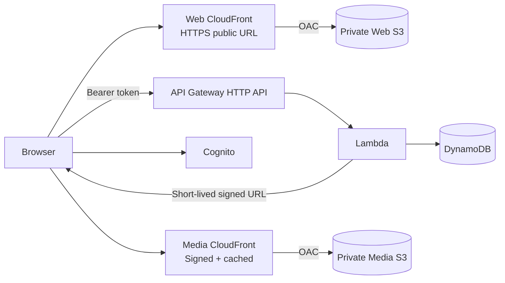
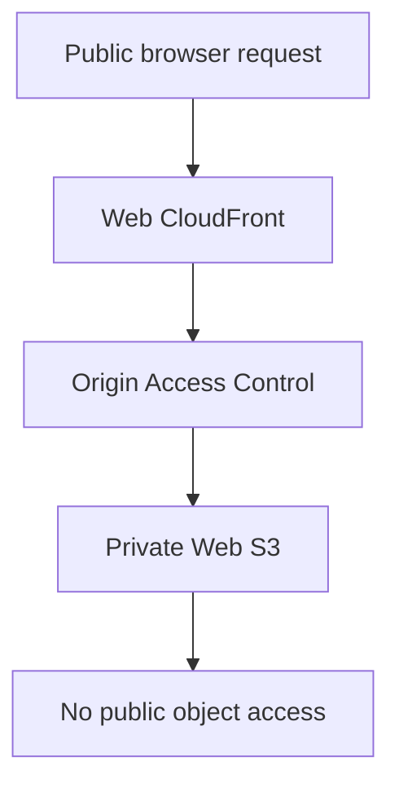

# EchoClass — CloudFront Web Application Deployment

> **Status:** Implemented on `feat/cloudfront-web-deployment`.
>
> This document describes the production-style deployment of the React/Vite application. It is separate from the private-media CloudFront distribution used for lesson video delivery.

## Architecture



## Implemented web infrastructure

The CDK stack provisions:

- private S3 bucket for the compiled Vite application;
- S3 Block Public Access and bucket-owner-enforced object ownership;
- dedicated CloudFront distribution using S3 Origin Access Control (OAC);
- HTTPS-only viewer access;
- `index.html` as the default root object;
- SPA fallback for CloudFront 403/404 responses;
- automatic deployment of `apps/web/dist` through CDK `BucketDeployment`;
- CloudFront invalidation after deployment;
- outputs for the web bucket name, distribution ID, and public CloudFront domain.

The web S3 bucket is not an S3 website endpoint. CloudFront is the public web delivery boundary.

## Media relationship

The web distribution does **not** expose lesson video objects.

Lesson media uses a separate private CloudFront distribution:

```text
Student
  ↓
API playback authorization
  ↓
Short-lived CloudFront signed URL
  ↓
Media CloudFront
  ↓ OAC / SigV4
Private Media S3
```

The media distribution requires a trusted CloudFront key group and caches video objects independently of the web application's static assets.

See `docs/16-private-media-delivery.md` and `docs/22-cloudfront-media-playback-implementation.md` for the complete media-delivery contract.

## Production environment configuration

The frontend consumes the existing public Vite configuration variables:

- `VITE_API_BASE_URL`
- `VITE_COGNITO_REGION`
- `VITE_COGNITO_USER_POOL_ID`
- `VITE_COGNITO_CLIENT_ID`

No AWS access keys, IAM credentials, or media signing private keys belong in these variables.

## Build/deploy sequence

```bash
cp apps/web/.env.production.example apps/web/.env.production
# Set VITE_API_BASE_URL to the deployed API Gateway URL.

pnpm --filter web build
pnpm --filter @echoclass/infrastructure synth
pnpm --filter @echoclass/infrastructure exec cdk deploy EchoClass-dev
```

The CDK stack fails early if `apps/web/dist` is missing.

For the media deployment, also provide:

```bash
export ECHOCLASS_MEDIA_PUBLIC_KEY="$(cat media-public-key.pem)"
export ECHOCLASS_MEDIA_SIGNING_SECRET_ARN="<Secrets Manager ARN>"
```

The corresponding private key must exist only in Secrets Manager.

## API CORS strategy

The API accepts the deployed web origin through CDK context or `ECHOCLASS_WEB_ORIGIN`:

```bash
cdk deploy EchoClass-dev --context webOrigin=https://<cloudfront-domain>
```

or:

```bash
ECHOCLASS_WEB_ORIGIN=https://<cloudfront-domain> cdk deploy EchoClass-dev
```

The default remains `http://localhost:5173` for local development.

## SPA routing

React Router needs deep links to return the application shell rather than an S3 object-not-found response. CloudFront maps both 403 and 404 origin responses to `/index.html` with status 200.

## Security boundary



Required invariants:

- web S3 bucket remains private;
- media S3 bucket remains private;
- CloudFront is the intended public delivery path for both distributions;
- OAC signs CloudFront-to-S3 requests;
- media viewers require valid short-lived signed URLs;
- frontend contains no AWS IAM credentials or signing private keys;
- API authorization continues to use Cognito access tokens.

## Verification checklist

1. `/` loads over HTTPS from the web CloudFront URL.
2. A client-side route loads directly after a hard refresh.
3. Cognito sign-in works.
4. `/api/v1/me` succeeds with the Cognito access token.
5. Teacher/student class flows work.
6. Lesson metadata loads.
7. Playback response contains the media CloudFront domain.
8. Video plays and seeks through media CloudFront.
9. Echo create/list/update/delete works.
10. Direct public S3 access to the web bucket fails.
11. Direct public S3 access to media objects fails.
12. An expired media signed URL is rejected.

## Follow-up hardening

The following remain outside this deployment slice:

- custom domain + ACM certificate;
- Route 53 DNS;
- CI/CD deployment pipeline;
- WAF;
- multi-region deployment;
- signing-key rotation automation;
- deeper cache/observability tuning.
