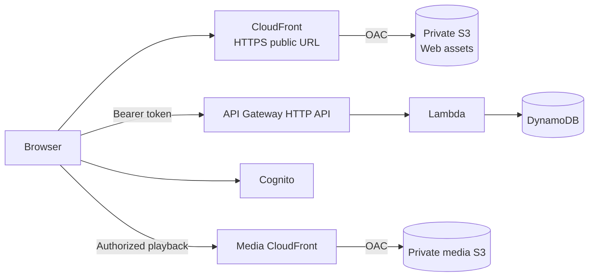
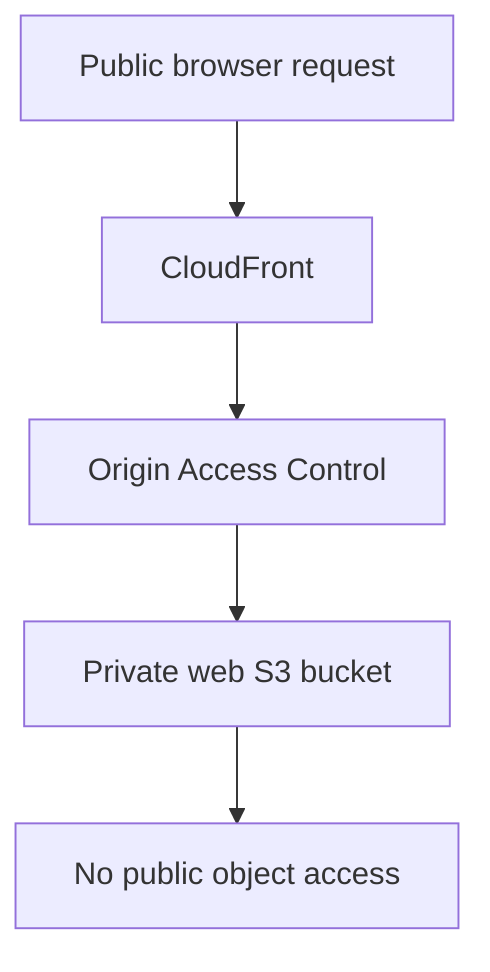

# EchoClass — CloudFront Web Application Deployment

> **Status:** Implemented on `feat/cloudfront-web-deployment`.
>
> This document describes the production-style deployment of the React/Vite application. It is separate from the existing private-media CloudFront distribution: the web application gets its own private S3 origin and CloudFront distribution.

## Architecture



## Implemented infrastructure

The CDK stack now provisions:

- A private S3 bucket for the compiled Vite application.
- S3 Block Public Access and bucket-owner-enforced object ownership.
- A dedicated CloudFront distribution using S3 Origin Access Control (OAC).
- HTTPS-only viewer access through CloudFront.
- `index.html` as the default root object.
- SPA fallback for CloudFront 403/404 responses to `/index.html` with a 200 response.
- Automatic deployment of `apps/web/dist` through CDK `BucketDeployment`.
- CloudFront invalidation after deployment.
- Outputs for the web bucket name, distribution ID, and public CloudFront domain.

The S3 web bucket is intentionally not configured as an S3 website. The browser receives only the CloudFront URL; CloudFront is the public delivery boundary.

## Production environment configuration

The frontend still consumes the existing public Vite configuration variables:

- `VITE_API_BASE_URL`
- `VITE_COGNITO_REGION`
- `VITE_COGNITO_USER_POOL_ID`
- `VITE_COGNITO_CLIENT_ID`

A template is provided at `apps/web/.env.production.example`.

No AWS access keys or IAM credentials belong in these variables. They are compiled into the public application only where the value is intentionally public configuration.

## Build/deploy sequence

The web distribution deploys the contents of `apps/web/dist`, so the production build must exist before `cdk synth` or `cdk deploy`.

```bash
cp apps/web/.env.production.example apps/web/.env.production
# Set VITE_API_BASE_URL to the already deployed API Gateway URL.

pnpm --filter web build
pnpm --filter @echoclass/infrastructure synth
pnpm --filter @echoclass/infrastructure exec cdk deploy EchoClass-dev
```

The CDK stack fails early with a clear message if `apps/web/dist` is missing. This prevents accidentally deploying an empty web origin.

## API CORS strategy

The API must allow the deployed CloudFront origin in addition to localhost during the transition.

The stack accepts the web origin through either CDK context or an environment variable:

```bash
cdk deploy EchoClass-dev --context webOrigin=https://<cloudfront-domain>
```

or:

```bash
ECHOCLASS_WEB_ORIGIN=https://<cloudfront-domain> cdk deploy EchoClass-dev
```

The default remains `http://localhost:5173` so existing local development is not broken.

### First deployment

Because a new CloudFront distribution receives its domain after CloudFormation creates it, the rollout can be completed in two deployments:

1. Deploy the stack with the default/local CORS origin.
2. Read `WebDistributionDomainName` from the stack outputs.
3. Redeploy with that CloudFront URL as `webOrigin`.
4. Rebuild the frontend if the API base URL or other production variables changed, then deploy again.

Once a stable custom domain is introduced, the custom domain should become the permanent `webOrigin` instead of the generated CloudFront hostname.

## SPA routing

React Router needs deep links such as `/student/classes/.../lessons/...` to return the application shell rather than an S3 object-not-found page.

CloudFront therefore maps both 403 and 404 origin responses to `/index.html` and returns status 200. This keeps client-side routing working for direct navigation and browser refreshes.

## Security boundary



Required invariants:

- S3 web bucket remains private.
- CloudFront is the only intended public web delivery path.
- OAC signs CloudFront-to-S3 requests.
- Viewer traffic is redirected to HTTPS.
- Frontend contains no AWS IAM credentials.
- API authorization continues to use Cognito access tokens.
- Video playback continues through the existing private-media CloudFront distribution; the web distribution does not expose media objects.

## Verification checklist

After deployment, verify from the CloudFront URL:

1. `/` loads over HTTPS.
2. A client-side route loads directly after a hard refresh.
3. Cognito sign-in works.
4. `/api/v1/me` succeeds with the Cognito access token.
5. Teacher/student class flows work.
6. Lesson metadata loads.
7. Authorized video playback uses the media CloudFront distribution.
8. Echo create/list/update/delete works.
9. Refreshing the lesson retrieves the persisted Echo.
10. Direct public S3 access to the web bucket fails.
11. Direct public S3 access to media objects remains denied.

## Deployment outputs

The stack now exposes:

- `WebBucketName`
- `WebDistributionId`
- `WebDistributionDomainName`
- `WebOrigin`
- Existing `ApiUrl`
- Existing media CloudFront outputs

The final submission URL is the value of `WebDistributionDomainName` until a custom domain is configured.

## Follow-up hardening

The following are intentionally outside this slice:

- Custom domain + ACM certificate.
- Route 53 DNS.
- CI/CD deployment pipeline.
- WAF.
- Multi-region deployment.
- Hashed immutable asset cache policy beyond the standard CloudFront optimized policy.
