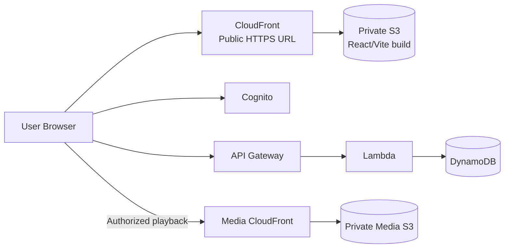
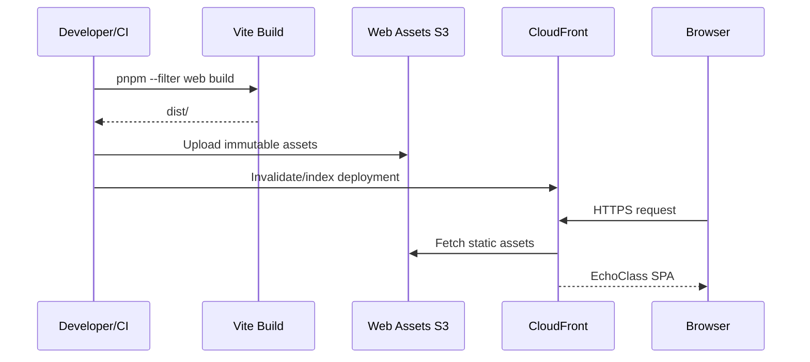
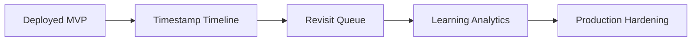

# EchoClass — Remaining Implementation Roadmap

> **Current snapshot:** August 29, 2026. The Echo MVP on `feat/echo-mvp` is complete.

## Current position

The core MVP now supports:

- Cognito authentication and server-side identity.
- Teacher/student authorization.
- Classes, memberships, and stable invite codes.
- Lesson lifecycle management.
- Private S3 video uploads.
- Authorized lesson playback.
- Timestamped Echo CRUD backed by DynamoDB.
- Playback continuity across browser tab changes.
- CloudFront private-media infrastructure.

The immediate priority is no longer another product feature.

# Priority 1 — Deploy the web application

The submission requires a publicly accessible application URL.

## Target architecture

## Deployment flow

## Required implementation work

1. Create a dedicated private S3 bucket for the frontend.
2. Create CloudFront OAC and distribution.
3. Configure default root object and SPA fallback/error behavior.
4. Configure cache policies:
   - immutable hashed assets cached aggressively;
   - `index.html` short/no-cache.
5. Provide production frontend environment configuration.
6. Ensure API Gateway CORS allows the deployed CloudFront origin.
7. Ensure Cognito app-client callback/sign-out URLs allow the deployed origin.
8. Deploy and smoke-test the complete MVP.
9. Record the final CloudFront URL in the README/deployment documentation.

## Acceptance checklist

- [ ] Public HTTPS URL loads the React app.
- [ ] Refreshing a nested route works.
- [ ] Cognito login works.
- [ ] API calls work from CloudFront origin.
- [ ] Video playback works.
- [ ] Echo CRUD works and persists.
- [ ] No browser secrets/AWS credentials are exposed.

# Priority 2 — Production hardening

After the submission deployment:

- automated frontend tests for critical lesson/Echo flows;
- backend tests for authorization and ownership;
- CI for lint, typecheck, tests, build, and CDK synth;
- CloudWatch alarms and operational dashboards;
- custom domain and ACM certificate if required;
- separate staging/production configuration.

# Future product roadmap

Potential future work:

- richer timeline navigation and Echo markers;
- Revisit MVP based on saved Echoes;
- learning progress and analytics;
- notifications;
- broader test coverage.

## Recommended next branch

`feat/cloudfront-web-deployment`
