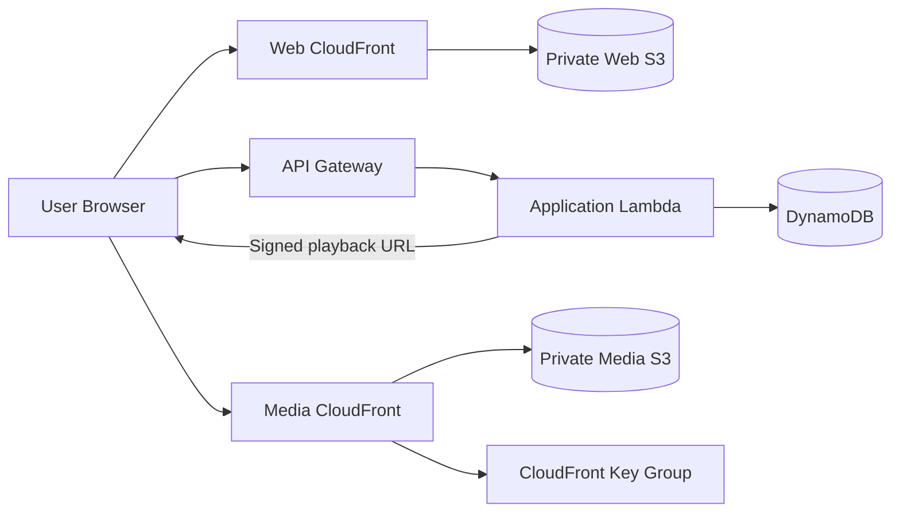
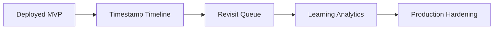

# EchoClass — Remaining Implementation Roadmap

> **Current snapshot:** August 30, 2026 — `feat/cloudfront-web-deployment`.

## Current position

The EchoClass MVP now supports:

- Cognito authentication and server-side identity.
- Teacher/student authorization.
- Classes, memberships, and stable invite codes.
- Lesson lifecycle management.
- Private S3 video uploads.
- Student-authorized lesson playback.
- Timestamped Echo CRUD backed by DynamoDB.
- Playback continuity across browser tab changes.
- Private media CloudFront infrastructure.
- Signed CloudFront playback URLs with short-lived viewer authorization.
- CloudFront-cached media delivery while S3 remains private.
- Public React/Vite web delivery through a separate CloudFront distribution.

## Completed deployment path

## Media-delivery implementation completed

The previous direct-S3 playback path has been replaced with:

1. Student requests `/lessons/{lessonId}/playback` with a Cognito access token.
2. Lambda verifies the user, lesson state, and class membership.
3. Lambda reads the private CloudFront signing key from Secrets Manager.
4. Lambda creates a short-lived signed CloudFront URL.
5. Browser requests the video from CloudFront.
6. CloudFront validates the signed URL and serves the object from cache or private S3 through OAC.

The media distribution does not forward signed URL query parameters to S3, so signatures do not become part of the origin request/cache key.

## Remaining operational acceptance

- [ ] Provision the RSA media signing key pair.
- [ ] Store the private key in AWS Secrets Manager.
- [ ] Deploy the stack with `ECHOCLASS_MEDIA_PUBLIC_KEY` and `ECHOCLASS_MEDIA_SIGNING_SECRET_ARN`.
- [ ] Verify the playback endpoint returns the CloudFront domain.
- [ ] Verify video playback and seeking through CloudFront.
- [ ] Verify expired signed URLs are rejected.
- [ ] Verify direct S3 object access remains denied.
- [ ] Verify a second authorized playback request can use a CloudFront cache hit.

## Next engineering priority — Production hardening

After the submission path is verified:

- automated frontend tests for critical lesson/Echo flows;
- backend tests for authorization and ownership;
- CI for lint, typecheck, tests, build, and CDK synth;
- CloudWatch alarms and operational dashboards;
- custom domain and ACM certificate if required;
- separate staging/production configuration;
- signing-key rotation procedure and operational runbook.

## Future product roadmap

Potential future work:

- richer timeline navigation and Echo markers;
- Revisit MVP based on saved Echoes;
- learning progress and analytics;
- notifications;
- broader test coverage.

## Branch

`feat/cloudfront-web-deployment`
