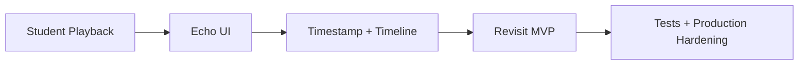
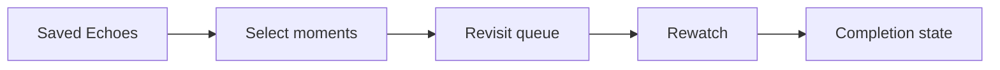

# EchoClass — Documentation Status Addendum

> **Current snapshot:** August 2026 on `feat/echo-mvp`.

This document reconciles the historical plans in `docs/` with the implementation now present in the repository.

## What is implemented

- Cognito authentication and backend access-token verification.
- Application-user bootstrap and backend-derived identity.
- Teacher/student role-aware authorization.
- Classes, memberships, stable invite-code handling, and member management.
- Lesson creation, updates, publication lifecycle, and student access rules.
- Private S3 media storage.
- Direct multipart browser-to-S3 uploads coordinated by Lambda.
- CloudFront with Origin Access Control.
- Authorized lesson playback and timeline backend endpoints.
- Dedicated Echo Lambda with create/list/update/delete persistence.
- Frontend application shell, account controls, settings, and theme preferences.

## Documentation interpretation

The following documents are primarily **historical planning/design sources** and should not be read as current implementation status:

- `01-requirements.md`
- `02-page-architecture.md`
- `03-wireframes.md`
- `04-visual-prototype.md`
- `05-component-architecture.md`
- `06-code.md`
- `07-implementation-plan.md`
- `09-landing-page-plan.md`
- `10-account-settings-plan.md`
- `11-mvp-execution-plan.md`
- `12-mvp-domain-contracts.md`

Documents `13` through `18` describe infrastructure/backend foundations that have since been expanded into working implementation.

## Remaining implementation roadmap



### 1. Student playback
Complete and verify the full frontend flow:
- load real lesson metadata;
- request authorized playback;
- configure the HTML5 player;
- handle loading, denied, expired, and missing-media states.

### 2. Echo UI
Connect the implemented backend to the student experience:
- capture player timestamps;
- create/list/edit/delete Echoes;
- optional notes and Echo types;
- ownership-aware controls;
- selecting an Echo seeks the player.

### 3. Timestamp URLs and timeline
Recommended URL shape:

```text
/lessons/<lessonId>?t=<seconds>
```

Add safe parsing, media-ready seeking, Echo/player synchronization, and accessible timeline markers.

### 4. Revisit MVP
Define and implement the first Revisit workflow:



### 5. Production hardening
- automated tests for authorization and ownership;
- frontend tests for critical lesson/Echo flows;
- CI for lint, typecheck, tests, build, and CDK synth;
- CloudWatch alarms/operational monitoring;
- separate production configuration and hosting strategy.

## Recommended next development order

1. `feat/student-playback-integration`
2. `feat/echo-ui-integration`
3. `feat/lesson-timestamp-timeline`
4. `feat/revisit-mvp`
5. `chore/test-and-production-hardening`

## MVP completion checklist

- [x] Cognito and server-side identity.
- [x] Classes, memberships, and stable invites.
- [x] Lesson lifecycle.
- [x] Direct private video upload.
- [x] CloudFront private-media foundation.
- [x] Echo backend CRUD.
- [ ] Student private playback verified end-to-end in the UI.
- [ ] Complete Echo UI CRUD and player integration.
- [ ] Timestamp/timeline navigation.
- [ ] Critical loading/error/empty states.
- [ ] Automated critical-path tests.
