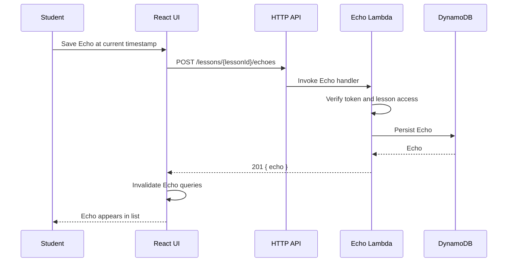
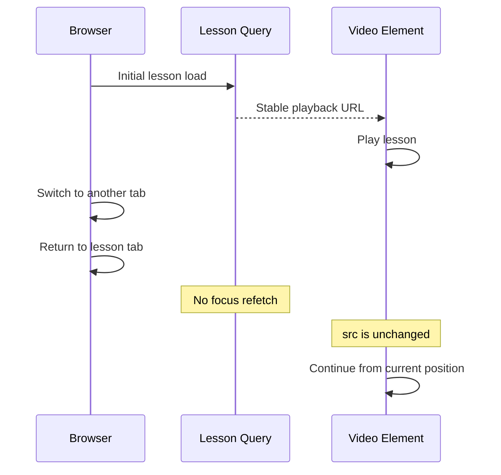
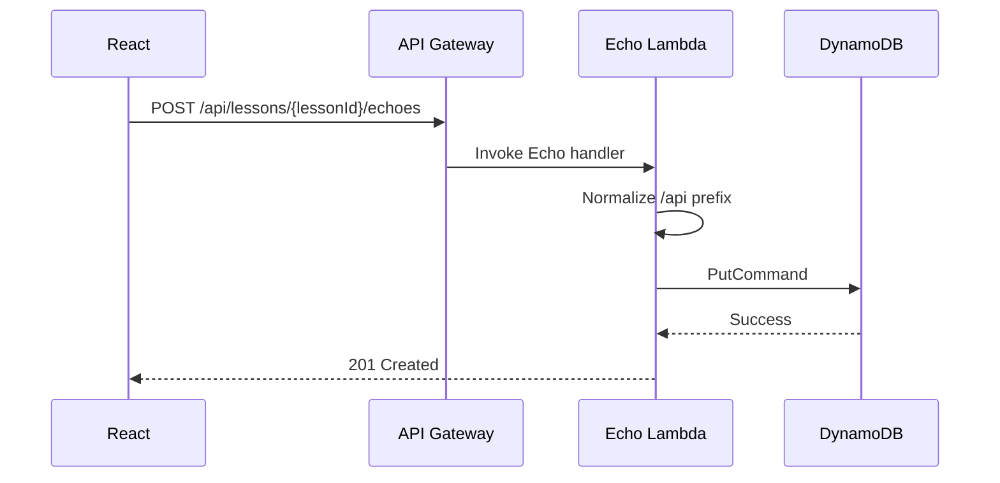

# EchoClass — Echoes and Playback Focus Fix

## Scope

This document records the investigation and fix applied on `feat/echo-mvp` for:

1. `Unable to save this Echo. Please try again.`
2. `Unable to load Echoes.`
3. Lesson video restarting from the beginning after switching browser tabs.

## Findings

### 1. Echo creation used the wrong API route

The frontend sent Echo creation requests to:

```text
POST /api/echoes
```

The deployed API route exists, but the Echo Lambda handler only supports creation when the lesson is part of the route:

```text
POST /api/lessons/{lessonId}/echoes
```

The Lambda needs the lesson ID from the path in order to authorize student access and validate the timestamp against the lesson duration. As a result, the frontend request reached a route that could not be processed as a valid Echo creation request.

### 2. Echo loading errors were caused by the same route/contract area being inconsistent

The lesson-specific Echo read route is:

```text
GET /api/lessons/{lessonId}/echoes
```

The client already targeted that route, while creation targeted a different contract. The implementation is now normalized so all lesson-bound Echo mutations and reads consistently use the lesson-scoped API contract.

### 3. Video reset was caused by focus-driven data refetching

The authorized lesson query contains the playback authorization, including the video URL. TanStack Query refetches stale queries when the browser window regains focus by default.

When the lesson query refetched after returning to the tab, a new playback URL could be produced. React then received a changed `src` for the HTML5 video element, causing the media element to reload and restart from the beginning.

## Fix Applied

### Frontend Echo API

Echo creation now sends:

```text
POST /api/lessons/{lessonId}/echoes
```

The request body contains only the Echo payload:

```json
{
  "timestampSeconds": 123.45,
  "type": "QUESTION",
  "note": "Optional note"
}
```

### Query focus behavior

The following queries now explicitly disable refetching on browser window focus:

- authorized lesson query
- current student's Echo list
- lesson-specific Echo list

This preserves the current HTML5 video element and its playback position while the user switches away from and back to the browser tab.

## Expected Behavior After the Fix



For playback:



## Verification Checklist

- [ ] Load a published lesson as a student.
- [ ] Save each Echo type.
- [ ] Confirm the new Echo appears without a page reload.
- [ ] Reload the lesson and confirm saved Echoes load.
- [ ] Start video playback, switch to another browser tab, then return.
- [ ] Confirm playback position is preserved and the video does not restart at zero.
- [ ] Confirm existing lesson/class functionality remains unchanged.

## Follow-up

The current playback implementation uses short-lived S3 presigned URLs. The infrastructure already contains a private CloudFront distribution, and a future media-delivery slice should complete the migration to CloudFront-based playback. That work is separate from this focus-reset fix.


## Second Investigation — Actual Production Failure

The previous frontend route correction was not sufficient because the actual failure was at **API Gateway route matching**, before the Echo Lambda could execute.

The React client calls Echo endpoints with the same prefix used by the rest of the application:

```text
/api/echoes
/api/lessons/{lessonId}/echoes
```

However, the CDK stack had registered the Echo Lambda only on unprefixed API Gateway routes:

```text
/echoes
/lessons/{lessonId}/echoes
```

Because API Gateway route matching happens before Lambda invocation, requests such as `POST /api/lessons/{lessonId}/echoes` did not reach `echo-handler.mjs` at all. Therefore `createEcho()` never executed and no DynamoDB item could be created. This also explains why the DynamoDB table remained empty.

### Infrastructure Fix

The stack now registers Echo routes for the prefixes supported by the application handler and frontend contract:

- `/api/...`
- `/api/v1/...`
- legacy unprefixed routes

All three route forms invoke the same Echo Lambda, whose path normalization then maps them to the canonical internal routes.

### Resulting Request Path



This is the missing infrastructure connection that prevented Echoes from ever reaching DynamoDB.


## Third Investigation — POST Returned 400

After API Gateway routing was corrected, the POST request reached the Echo Lambda but still returned **400**. The validation code derived the lesson duration from `Number(lesson.media?.durationSeconds ?? 0)` and unconditionally required `timestampSeconds <= durationSeconds`.

Current lesson media records do not reliably persist `durationSeconds`. Missing metadata therefore became `0`, which made every Echo created after the first instant of playback invalid.

### Fix

Timestamp validation now distinguishes between a known positive duration and unavailable duration metadata:

- timestamp must always be finite and non-negative;
- the upper-bound check is enforced only when a valid positive lesson duration is available.

This preserves protection against invalid timestamps while allowing the actual HTML5 video playback timestamp to be persisted for lessons whose media duration metadata has not yet been populated.

### Final POST Flow

`POST /api/lessons/{lessonId}/echoes` → API Gateway → Echo Lambda → token/access validation → timestamp validation → DynamoDB `PutCommand` → **201 Created**.


## CloudWatch Diagnostic Instrumentation for Remaining 500

The Echo POST handler now emits a request ID and stage-by-stage structured JSON logs for:

1. request arrival and route;
2. token verification;
3. user resolution and role;
4. lesson authorization;
5. Echo payload validation;
6. DynamoDB `PutCommand` start, including table name and generated keys;
7. DynamoDB success metadata;
8. the exact AWS SDK error name, message, code, stack, and request metadata on failure.

The DynamoDB write is also wrapped independently, so CloudWatch will clearly distinguish an authorization/lesson failure from a `PutCommand` failure.

### What to send after deployment

Open the Lambda log group:

`/aws/lambda/EchoClass-dev-echo-api`

Filter around the failing request and send the JSON entry with `event: "dynamodb-put-failed"` or `event: "request-failed"`. That entry will contain the exact AWS error instead of only the browser's HTTP 500.
