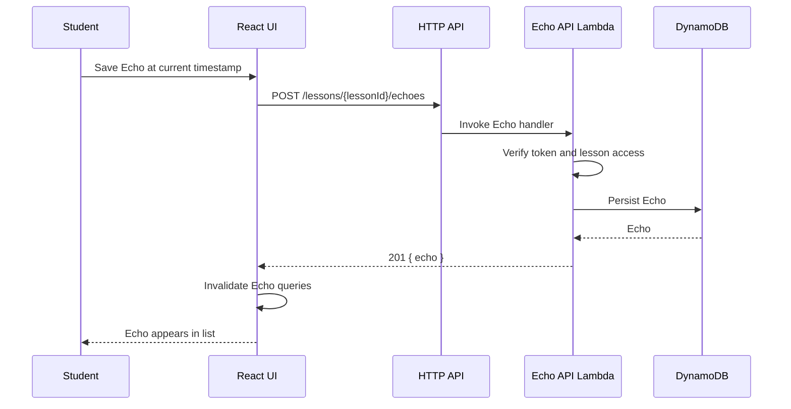
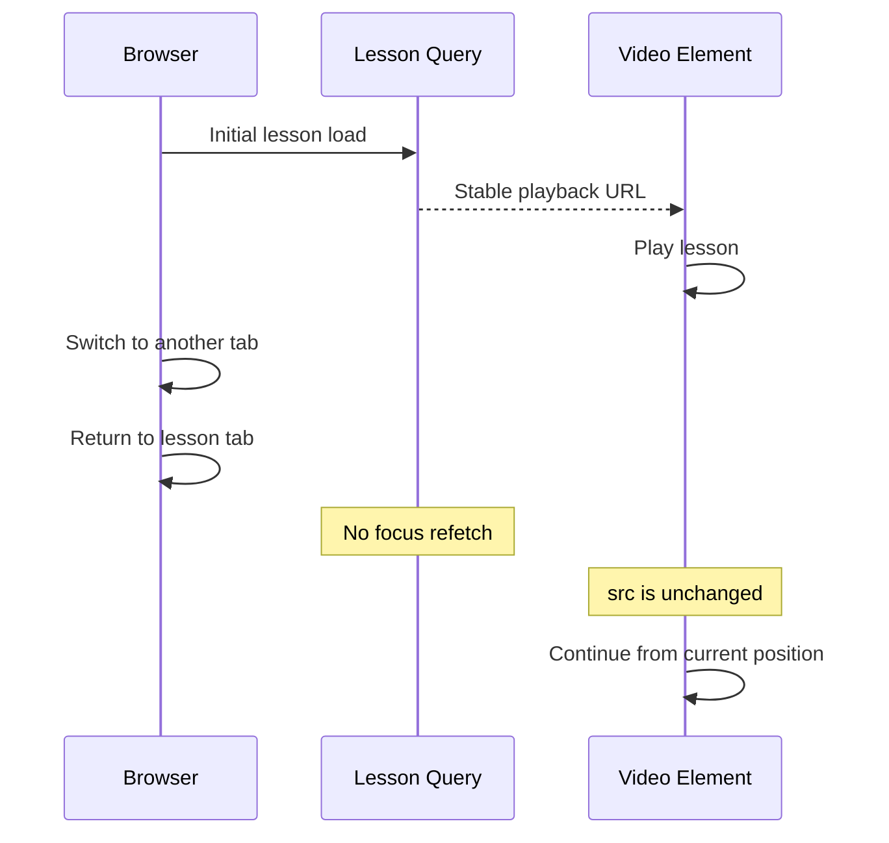
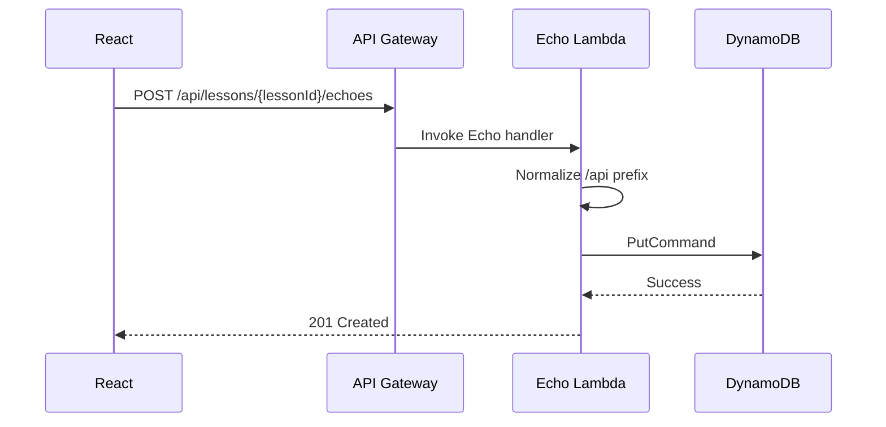
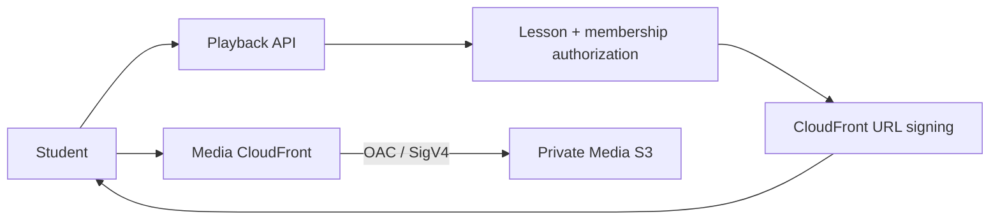

# EchoClass — Echoes and Playback Focus Fix

## Scope

This document records the investigation and fix applied on `feat/echo-mvp` for:

1. `Unable to save this Echo. Please try again.`
2. `Unable to load Echoes.`
3. Lesson video restarting from the beginning after switching browser tabs.

## Findings

### 1. Echo creation used the wrong API route

The frontend sent Echo creation requests to:

```text
POST /api/echoes
```

The deployed API route exists, but the Echo Lambda handler only supports creation when the lesson is part of the route:

```text
POST /api/lessons/{lessonId}/echoes
```

The Lambda needs the lesson ID from the path in order to authorize student access and validate the timestamp against the lesson duration.

### 2. Echo loading errors were caused by the same route/contract area being inconsistent

The lesson-specific Echo read route is:

```text
GET /api/lessons/{lessonId}/echoes
```

The implementation was normalized so all lesson-bound Echo reads and mutations consistently use the lesson-scoped API contract.

### 3. Video reset was caused by focus-driven data refetching

The authorized lesson query contains the playback authorization, including the video URL. TanStack Query refetched stale queries when the browser window regained focus.

When the lesson query refetched after returning to the tab, a new playback URL could be produced. React then received a changed `src` for the HTML5 video element, causing the media element to reload and restart from the beginning.

## Fix Applied

### Frontend Echo API

Echo creation now sends:

```text
POST /api/lessons/{lessonId}/echoes
```

### Query focus behavior

The authorized lesson query and relevant Echo queries disable browser-window-focus refetching. This preserves the current HTML5 video element and playback position while the user switches tabs.

## Expected Behavior After the Fix



For playback:



## Verification Checklist

- [ ] Load a published lesson as a student.
- [ ] Save each Echo type.
- [ ] Confirm the new Echo appears without a page reload.
- [ ] Reload the lesson and confirm saved Echoes load.
- [ ] Start video playback, switch to another browser tab, then return.
- [ ] Confirm playback position is preserved and the video does not restart at zero.
- [ ] Confirm existing lesson/class functionality remains unchanged.

## Follow-up: API Gateway routing failure

The frontend route correction alone was not sufficient because API Gateway route matching happened before the Echo Lambda could execute.

The CDK stack initially registered the Echo Lambda only on unprefixed routes:

```text
/echoes
/lessons/{lessonId}/echoes
```

while the frontend used `/api/...`. The stack was corrected to register the Echo routes for the supported prefixes:

- `/...`
- `/api/...`
- `/api/v1/...`

All forms invoke the same Echo Lambda, whose path normalization maps them to the canonical internal routes.



## Follow-up: POST returned 400

After API Gateway routing was corrected, timestamp validation still returned `400` when lesson media duration metadata was unavailable.

The fix now requires timestamps to be finite and non-negative, while enforcing the upper bound only when a valid positive lesson duration is available.

## CloudWatch diagnostic instrumentation

The Echo POST handler emits structured request/stage logs for:

1. request arrival and route;
2. token verification;
3. user resolution and role;
4. lesson authorization;
5. Echo payload validation;
6. DynamoDB `PutCommand` start;
7. DynamoDB success metadata;
8. AWS SDK errors on failure.

The DynamoDB write is wrapped independently so CloudWatch can distinguish authorization/lesson failures from `PutCommand` failures.

## Confirmed CloudWatch root cause — `updatedAt` ReferenceError

The remaining POST failure was a JavaScript runtime bug in `createEcho`:

```text
ReferenceError: updatedAt is not defined
```

The repository created `createdAt` but referenced `updatedAt` before declaring it.

The fix initializes both consistently:

```text
const createdAt = now();
const updatedAt = createdAt;
```

## Media delivery follow-up

The original playback focus fix intentionally left the application on short-lived S3 presigned URLs while the private CloudFront distribution existed only as infrastructure.

That follow-up is now complete on `feat/cloudfront-web-deployment`:



The playback endpoint now returns a short-lived signed CloudFront URL rather than an S3 presigned URL. CloudFront validates the viewer signature and can serve the private video from its edge cache while S3 remains inaccessible to anonymous users.

The signing private key is stored in AWS Secrets Manager and is never sent to the browser. See `docs/16-private-media-delivery.md` and `docs/22-cloudfront-media-playback-implementation.md` for the current implementation details.
