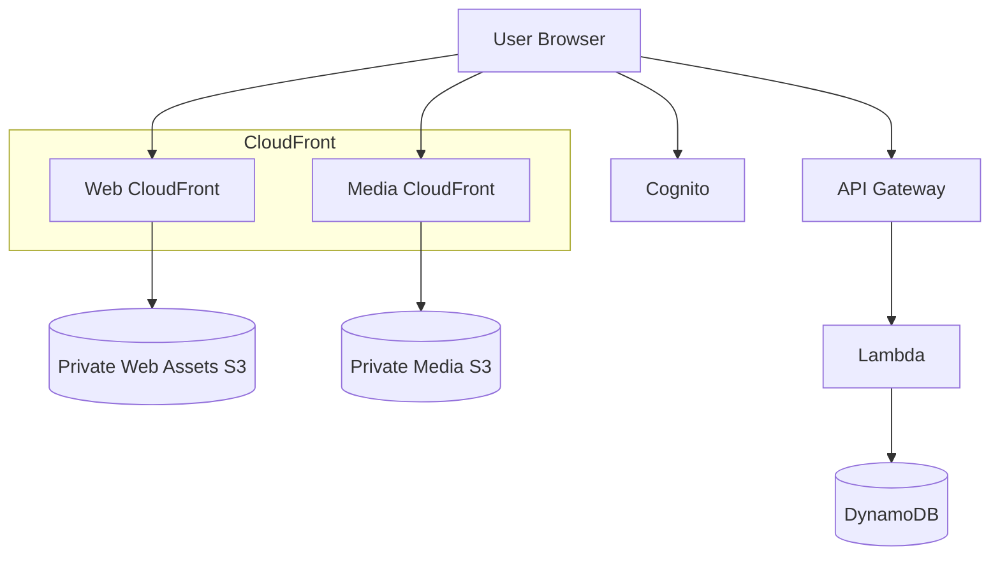
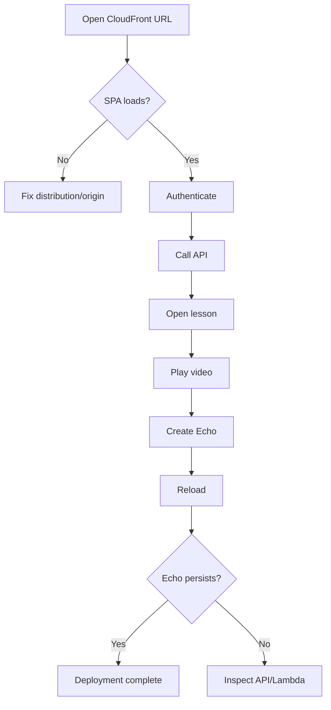

# EchoClass — Frontend CloudFront Deployment Plan

## Purpose

Deploy the completed EchoClass MVP as a public HTTPS React application for submission.

This deployment is separate from the existing private-media CloudFront distribution. The application distribution serves the Vite build; the media distribution continues protecting lesson videos.

## Desired architecture

## Infrastructure requirements

### Web asset bucket
- Private S3 bucket.
- Block Public Access enabled.
- CloudFront Origin Access Control.
- No public website hosting required.

### CloudFront distribution
- HTTPS viewer policy.
- Default root object: `index.html`.
- SPA fallback for application routes.
- Separate cache behavior for hashed assets and HTML.

### Frontend configuration
The production build must use:

- deployed API Gateway base URL;
- Cognito User Pool ID;
- Cognito app client ID;
- production callback/sign-out URLs where applicable.

No AWS credentials or server-side secrets belong in the browser build.

### Cross-origin configuration

After the CloudFront URL exists:

1. add it to API Gateway/Lambda CORS allowed origins;
2. add it to Cognito callback/sign-out configuration;
3. keep localhost allowed for development where required.

## Deployment verification

## Definition of done

A single public HTTPS URL can be submitted and demonstrates the complete EchoClass MVP:

- authentication;
- classes;
- lessons;
- video playback;
- Echo creation and persistence.
