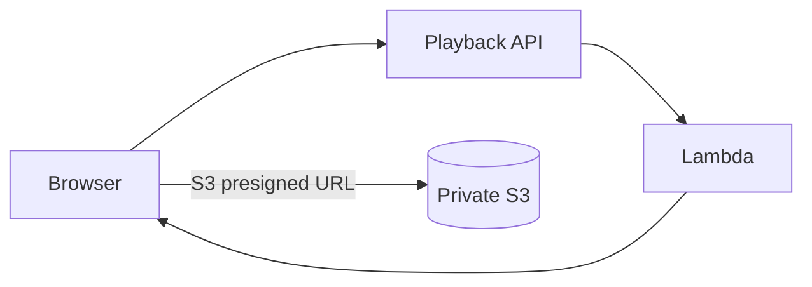
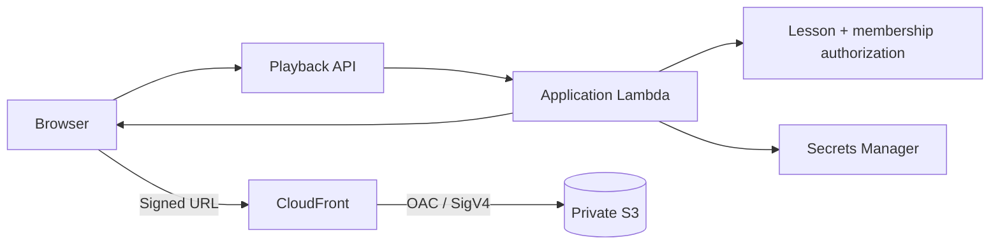

# EchoClass — CloudFront Media Playback Implementation

> **Status:** Implemented on `feat/cloudfront-web-deployment`.
>
> This slice completes the previously planned migration from direct S3 playback to private CloudFront playback.

## Before

The student playback endpoint authorized the lesson but returned a short-lived **S3 presigned GET URL**. That meant the browser fetched the video directly from S3.



This preserved S3 privacy but bypassed the existing CloudFront media distribution and therefore did not provide the intended CDN caching layer.

## After

The playback endpoint now returns a short-lived **CloudFront signed URL**.



The API is still responsible for application authorization. CloudFront is responsible for delivery authorization at the CDN boundary and for caching the media object.

## Signed URL lifecycle


## Cache design

The media distribution's default cache behavior:

- `GET` and `HEAD` only;
- HTTPS-only viewers;
- no cookies forwarded;
- no arbitrary query strings forwarded to S3;
- CloudFront signed URL query parameters handled at the viewer boundary;
- video object cached by path;
- byte-range requests supported by normal CloudFront/HTTP behavior.

The important distinction is that **authorization and caching are separate concerns**. CloudFront verifies each signed viewer request, while the underlying video object can remain cached and reused for authorized requests.

## Key management

The CloudFront trusted key group contains the public key. The corresponding private key is stored in AWS Secrets Manager.

```text
CloudFront public key
        │
        ▼
Trusted key group
        │
        ▼
Media cache behavior

Secrets Manager private key
        │
        ▼
Application Lambda
        │
        ▼
Signed playback URL
```

The private key must never be placed in:

- React/Vite environment variables;
- browser code;
- Git history;
- CloudFront URL responses;
- committed CDK context files.

## API contract

`GET /lessons/{lessonId}/playback` remains the student playback authorization endpoint.

Successful response:

```json
{
  "playbackUrl": "https://<media-cloudfront-domain>/lessons/<lessonId>/video.mp4?...",
  "expiresAt": "2026-08-30T01:00:00.000Z"
}
```

The URL lifetime is intentionally short. The frontend already avoids refetching the authorized lesson on browser focus because replacing the video `src` can restart playback.

## Failure behavior

If media signing is unavailable, the API must fail the playback request rather than silently returning a direct S3 URL. This preserves the architectural invariant that student playback goes through CloudFront.

Expected operational failure causes include:

- missing signing secret configuration;
- malformed signing secret;
- invalid private key;
- CloudFront key/public-key mismatch;
- missing media distribution domain.

These failures should be investigated in the application Lambda CloudWatch log group.

## Verification checklist

- [ ] Direct S3 object URL is denied.
- [ ] Student with active membership can call the playback endpoint.
- [ ] Playback response contains the CloudFront domain, not the S3 domain.
- [ ] Signed URL contains `Expires`, `Key-Pair-Id`, and `Signature`.
- [ ] Video plays through the CloudFront URL.
- [ ] Seeking works through HTTP range requests.
- [ ] A second authorized request can be served from CloudFront cache.
- [ ] Expired signed URLs are rejected by CloudFront.
- [ ] A user without lesson access cannot obtain a signed playback URL.
- [ ] The private signing key is absent from the frontend bundle and repository.

## Relationship to earlier documentation

`docs/16-private-media-delivery.md` originally documented only the CloudFront/OAC foundation and explicitly left signed playback for a later slice. This document records the completion of that later slice.

The current source of truth is therefore:

```text
Private S3
   ↓ OAC
CloudFront media distribution
   ↑
Short-lived signed viewer URL
   ↑
Application Lambda authorization
```
