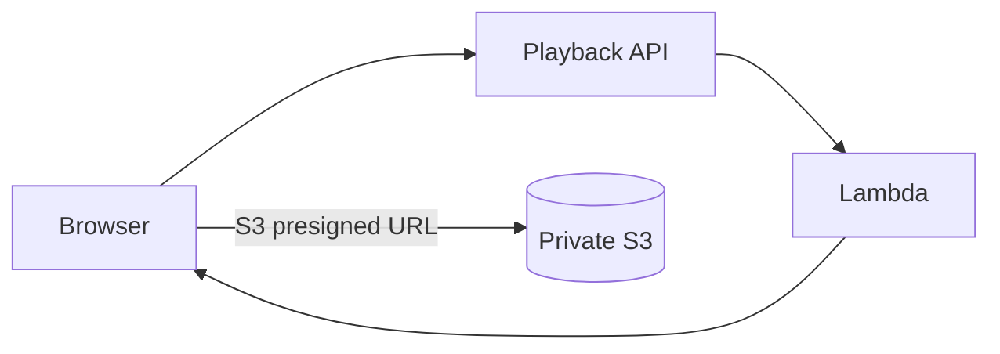
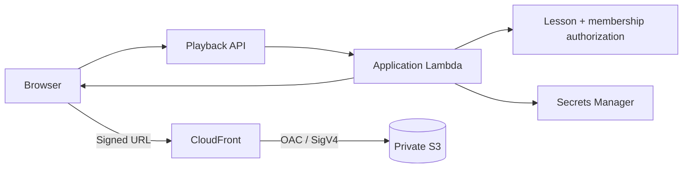
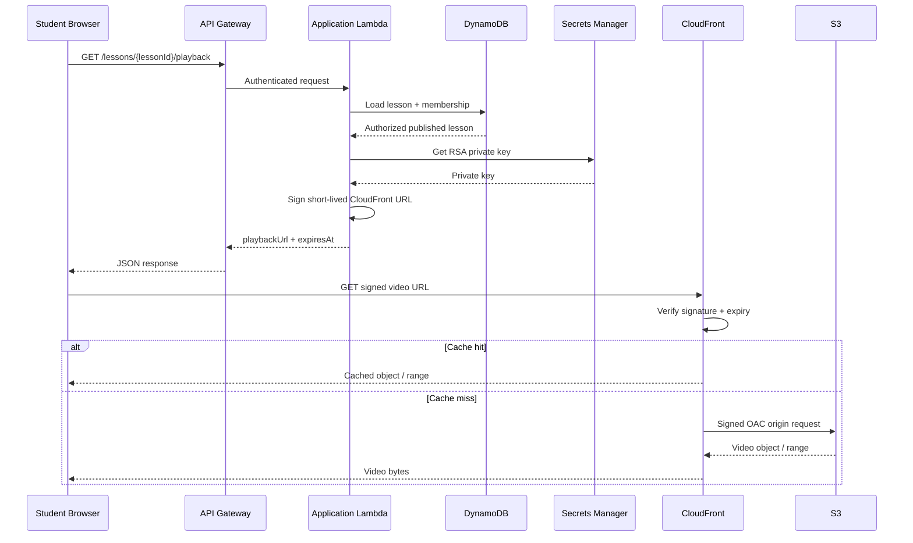
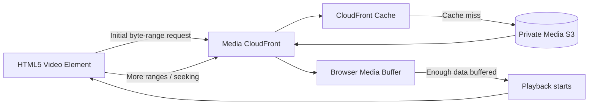

# EchoClass — CloudFront Media Playback Implementation

> **Status:** Implemented on `feat/cloudfront-web-deployment`.
>
> This slice completes the previously planned migration from direct S3 playback to private CloudFront playback.

## Before

The student playback endpoint authorized the lesson but returned a short-lived **S3 presigned GET URL**. That meant the browser fetched the video directly from S3.



This preserved S3 privacy but bypassed the existing CloudFront media distribution and therefore did not provide the intended CDN caching layer.

## After

The playback endpoint now returns a short-lived **CloudFront signed URL**.



The API is still responsible for application authorization. CloudFront is responsible for delivery authorization at the CDN boundary and for caching the media object.

## Signed URL lifecycle



## Progressive playback: the video is not fully downloaded first

EchoClass uses the browser's native HTML5 video loading behavior. The player does **not** wait for the complete MP4 before playback begins.



Typical playback is:

1. the browser requests an initial portion of the MP4 using an HTTP byte-range request;
2. CloudFront serves those bytes from cache or fetches them from S3 through OAC;
3. the browser buffers enough media data to decode and start playback;
4. playback begins while later portions continue to be fetched in the background;
5. additional ranges are requested as playback advances;
6. seeking can cause the browser to request a different byte range instead of requiring the whole object to be downloaded first.

The exact buffer size and range-request pattern are controlled by the browser and media stack. EchoClass does not implement a custom whole-file downloader.

This means a large lesson video can start playing after the initial data is available, while CloudFront continues delivering and caching the remaining content as required.

## Cache design

The media distribution's default cache behavior:

- `GET` and `HEAD` only;
- HTTPS-only viewers;
- no cookies forwarded;
- no arbitrary query strings forwarded to S3;
- CloudFront signed URL query parameters handled at the viewer boundary;
- video object cached by path;
- byte-range requests supported by normal CloudFront/HTTP behavior.

The important distinction is that **authorization and caching are separate concerns**. CloudFront verifies each signed viewer request, while the underlying video object can remain cached and reused for authorized requests.

## Key management

The CloudFront trusted key group contains the public key. The corresponding private key is stored in AWS Secrets Manager.

```text
CloudFront public key
        │
        ▼
Trusted key group
        │
        ▼
Media cache behavior

Secrets Manager private key
        │
        ▼
Application Lambda
        │
        ▼
Signed playback URL
```

The private key must never be placed in:

- React/Vite environment variables;
- browser code;
- Git history;
- CloudFront URL responses;
- committed CDK context files.

## API contract

`GET /lessons/{lessonId}/playback` remains the student playback authorization endpoint.

Successful response:

```json
{
  "playbackUrl": "https://<media-cloudfront-domain>/lessons/<lessonId>/video.mp4?...",
  "expiresAt": "2026-08-30T01:00:00.000Z"
}
```

The URL lifetime is intentionally short. The frontend avoids refetching the authorized lesson on browser focus because replacing the video `src` can restart playback.

## Failure behavior

If media signing is unavailable, the API must fail the playback request rather than silently returning a direct S3 URL. This preserves the architectural invariant that student playback goes through CloudFront.

Expected operational failure causes include:

- missing signing secret configuration;
- malformed signing secret;
- invalid private key;
- CloudFront key/public-key mismatch;
- missing media distribution domain.

These failures should be investigated in the application Lambda CloudWatch log group.

## Production incident: CloudFront signed URL HTTP 403

### Symptom

A valid-looking playback URL reached the media CloudFront distribution but returned HTTP `403 Forbidden`.

The request contained the expected `Expires`, `Key-Pair-Id`, and `Signature` query parameters, but CloudFront rejected the viewer signature.

### Root cause

The signing implementation used an incorrect URL-safe Base64 character mapping for CloudFront signatures. CloudFront requires this mapping:

```text
+  → -
=  → _
/  → ~
```

An incorrectly encoded signature cannot be validated against the trusted public key and results in CloudFront rejecting the request.

### Fix

The signer now applies CloudFront's required Base64 mapping when constructing the `Signature` query parameter. Newly generated signed URLs are therefore compatible with the CloudFront trusted key group.

Old URLs generated with the incorrect encoding must not be reused; clients must request a new playback URL after the Lambda fix is deployed.

## Production incident: OpenSSL decoder error

### Symptom

A deployed playback request returned HTTP 500 with:

```text
ERR_OSSL_UNSUPPORTED
error:1E08010C:DECODER routines::unsupported
```

### Root cause

The original signer assumed the Secrets Manager value was always JSON with a `privateKey` property. Secrets Manager can also store the complete PEM directly, and PEM text may be entered with literal `\\n` sequences instead of real line breaks. Passing an incorrectly extracted key to Node.js/OpenSSL causes the decoder failure.

### Fix

The signer accepts both:

1. a raw PEM stored directly as the secret value; or
2. JSON containing a `privateKey` string.

Literal `\\n` sequences are normalized to PEM line breaks before signing, and the value is checked for a private-key PEM header/footer.

### Whitespace-collapsed PEM values

The signer also tolerates PEM values whose Base64 body has been collapsed into whitespace-separated text. It reconstructs the PEM boundaries, removes whitespace from the Base64 body, and rebuilds standard 64-character lines before passing the key to OpenSSL.

The preferred operational format remains the complete private-key PEM stored without manual modification.

## Verification checklist

- [ ] Direct S3 object URL is denied.
- [ ] Student with active membership can call the playback endpoint.
- [ ] Playback response contains the CloudFront domain, not the S3 domain.
- [ ] Signed URL contains `Expires`, `Key-Pair-Id`, and `Signature`.
- [ ] Video starts without waiting for the complete MP4 download.
- [ ] Network requests show HTTP byte-range behavior during playback/seek as controlled by the browser.
- [ ] Video plays through the CloudFront URL.
- [ ] Seeking works through HTTP range requests.
- [ ] A second authorized request can be served from CloudFront cache.
- [ ] Expired signed URLs are rejected by CloudFront.
- [ ] A user without lesson access cannot obtain a signed playback URL.
- [ ] The private signing key is absent from the frontend bundle and repository.

## Relationship to earlier documentation

`docs/16-private-media-delivery.md` records the private S3 + CloudFront/OAC architecture. This document records the completed signed playback implementation, progressive media-loading behavior, and production fixes discovered during deployment.

The current source of truth is therefore:

```text
Private S3
   ↓ OAC
CloudFront media distribution
   ↑
Short-lived signed viewer URL
   ↑
Application Lambda authorization
   ↑
Cognito + lesson/membership checks
```
